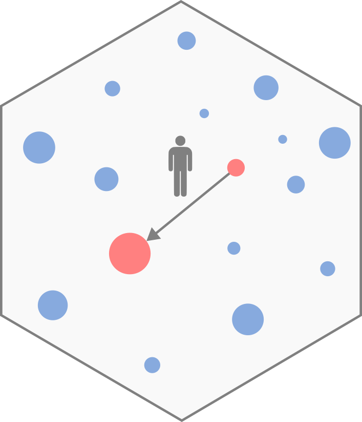

# __TDLM__ 

# Systematic comparison of trip distribution laws and models 

<!-- badges: start -->
[](https://github.com/EpiVec/TDLM/actions) 
[](https://github.com/EpiVec/TDLM) 
[](https://www.r-project.org/Licenses/GPL-3) 
[](https://github.com/EpiVec/TDLM/actions)
<!-- badges: end -->

## 1 Install

The package `TDLM` can be installed with the following command line in R session:

``` r
devtools::install_github("EpiVec/TDLM")
```

## 2 Tutorial

A tutorial vignette is available [here](https://epivec.github.io/TDLM/articles/TDLM.html).

## 3 Dependencies

`TDLM` depends on ... .

## 4  Citation

  

