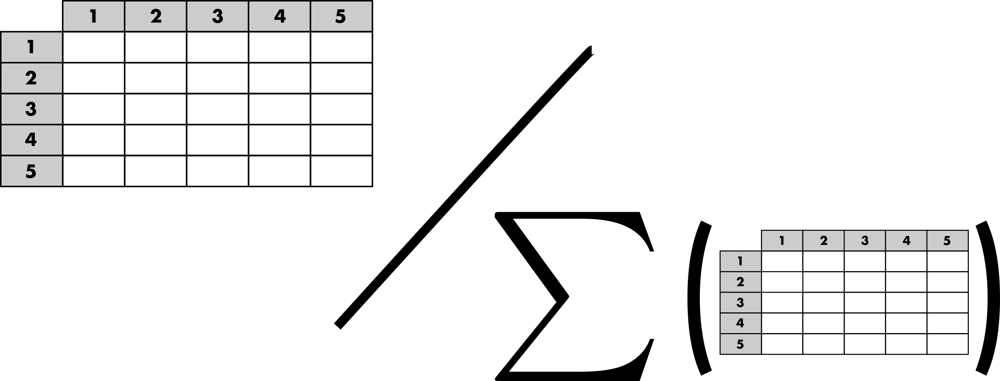

```{r setup, include=FALSE}

knitr::opts_chunk$set(echo = TRUE, message = TRUE, warning = FALSE,
                      fig.width = 8, fig.height = 8)
# Packages --------------------------------------------------------------------
suppressPackageStartupMessages({
  suppressWarnings({
    library(TDLM)
    library(sf)
  })
})

options(tinytex.verbose = TRUE)

```

# Introduction

This tutorial aims at describing the different features of the R package `TDLM`. 
The main purpose of the `TDLM`'s package is to propose a rigorous framework to 
fairly compare trip distribution laws and models [@Lenormand2016]. This general
framework is based on a two-step approach to generate mobility flows by 
separating the trip distribution law, gravity or intervening opportunities, from 
the modeling approach used to generate the flows from this law.

# A short note on terminology

This framework is part of the four-step travel model. It corresponds to the 
second step, called trip distribution, the aim of which is to match the trip 
origins with the trip destinations. The model used to generate the trips or 
flows, and more generally the degree of interaction between different locations,
are often called spatial interaction models. According to the research area, a 
matrix or a network formalism can be used to describe these spatial 
interactions. Origin-Destination matrix (or trip table) are often used in 
geography or transportation while in statistical physics or in the study of 
complex systems the term mobility networks is usually preferred. 

# Origin–Destination matrix

The description of movements in a certain area is represented by an
Origin-Destination matrix (OD matrix). The area of interest is divided into 
$n$ locations and $T_{ij}$ represents the volume of flows between location $i$ 
and location $j$. This volume usually represents a number of trips 
or a commuting flow (i.e. number of individuals living in $i$ and working in 
$j$). The OD matrix is squared, contains only positive values and can be a
zero-diagonal matrix (Figure 1). 

<br>
<center>
  
</center> 
<br>
<center>
  <b>Figure 1: Schematic representation of an Origin-Destination matrix.</b>
</center> 
<br>

# Aggregated inputs information

Three categories of inputs are usually considered to simulate an OD matrix 
(Figure 2). The masses and distances are the main ingredients used to generate a 
matrix of probabilities based on a given distribution law. Hence, the 
probability $p_{ij}$ to observe a trip from location $i$ to another location $j$
is based on the masses, the demand at origin ($m_i$) and the offer at 
destination  ($m_j$). Typically, the population is used as surrogate for the 
demand and offer. The probability of movements also depends on the costs based 
on the distance $d_{ij}$ between locations or the number of opportunities 
$s_{ij}$ between locations depending on the chosen law (more details in the next 
"Trip distribution laws" section). In general both the effect of the cost can be
adjusted with a parameter.

The margins are used to generate an OD matrix based on the matrix of 
probabilities by preserving the total number of trips ($N$), 
the number of out-going trips ($O_i$) and/or the number of in-coming trips 
($D_j$) (more details in the "Contrained distribution models" section).

<br>
<center>
  
</center> 
<br>
<center>
  <b>Figure 2: Schematic representation of the aggregated inputs information.
  </b>
</center> 
<br>

# Trip distribution laws

The purpose of a trip distribution law is to estimate the probability $p_{ij}$ 
that out of all the possible travels in the system we have one between the 
location $i$ and the location $j$. This probability is asymmetric in $i$ and $j$
as the flows themselves. It takes the form of squared matrix of probabilities.
This probability is normalized to all possible couples of origins and 
destinations, $\sum_{i,j=1}^n p_{ij} =1$. Hence, a matrix of probabilities can 
be obtained by normalizing any OD matrix (Figure 3).

<br>
<center>
  
</center> 
<br>
<center>
  <b>Figure 3: Schematic representation of the matrix of probabilities.
  </b>
</center> 
<br>

As mentioned in the previous section, most of the trip distribution law depends
on the demand at origin ($m_i$), the offer at destination  ($m_j$) and a cost to 
move from $i$ to $j$. There are two major approaches for the estimation of the
matrix of probability. The traditional gravity approach, in analogy with the 
Newton's law of gravitation, is based on the assumption that the amount of trips
between two locations is related to their populations and decays with a function
of the distance $d_{ij}$ between locations. In contrast to the gravity law, the 
laws of intervening opportunities hinges on the assumption that the number of 
opportunities $s_{ij}$ between locations plays a more important role than the 
distance [@Lenormand2016]. This fundamental difference between the two schools
of thought is illustrated in Figure 4.

<br>
<center>
  
</center> 
<br>
<center>
  <b>Figure 4: Illustration of the fundamental difference between gravity and 
  intervening opportunity laws.
  </b>
</center> 
<br>

It is important to note that the effect of the cost between locations (distance 
or number of opportunities) can usually be adjusted with a parameter that can be
calibrated automatically or by comparing the simulated matrix with observed
data (more details in the example based on real commuting data in Kansas below).  

# Constrained distribution models

The purpose of the trip distribution models is to generate an OD matrix 
$\tilde{T}=(\tilde{T}_{ij})$ by 
drawing at random $N$ trips from the trip distribution law 
$(p_{ij})_{1 \leq i,j \leq n}$ respecting different level of constraints 
according to the model. We considered four different types of models in this
package. As can be observed in Figure 5, the four models respect different level
of constraints from the total number of trips to the total number of out-going 
and in-coming trips by locations (i.e. the margins).

<br>
<center>
  
</center> 
<br>
<center>
  <b>Figure 5: Schematic representation of the constrained distribution models.
  </b>
</center> 
<br>

More specifically, the volume of flows $\tilde{T}_{ij}$ is generated from the
matrix of probability with multinomial random draws that will take different 
forms according to the model used [@Lenormand2016]. Therefore, since the process
is stochastic, each simulated matrix is unique and composed of integers. Note 
that it is also possible to generate an average matrix from the multinomial 
trials.

# Goodness-of-fit measures

Finally, the trip distribution laws can be calibrated and both the trip 
distribution laws and models can be evaluated by comparing a simulated matrix
$\tilde{T}$ with the observed one $T$. These comparison are based on different
goodness-of-fit measures that can take into accounts the distance between 
location or not (more details in the example based on real commuting data in 
Kansas below).

---

# Example of commuting in Kansas

## Data

In this example, we will use commuting data from US Kansas in 2000 to illustrate
the main package's functions. The dataset is composed of three tables and a 
spatial object providing information of commuting flows between the 105 US 
Kansas counties in 200. The observed OD matrix 
[od](https://epivec.github.io/TDLM/reference/od.html) is a zero-diagonal squared
matrix of integers. Each element of the matrix represents the number of 
commuters between a pair of US Kansas counties.

```{r}
data(od)

od[1:10, 1:10]

dim(od)
```

The aggregated data are composed of the 
[distance](https://epivec.github.io/TDLM/reference/distance.html) matrix,

```{r}
data(distance)

distance[1:10, 1:10]

dim(distance)
```

and the masses and margins contained in the data.frame 
[mass](https://epivec.github.io/TDLM/reference/mass.html).

```{r}
data(mass)

mass[1:10,]

dim(mass)

mi <- as.numeric(mass[,1])
names(mi) <- rownames(mass)

mj <- mi

Oi <- as.numeric(mass[,2])
names(Oi) <- rownames(mass)

Dj <- as.numeric(mass[,3])
names(Dj) <- rownames(mass)
```

Finally, [county](https://epivec.github.io/TDLM/reference/county.html) is a 
spatial object containing the geometry of the 105 US Kansas counties in 2000. 

```{r}
#library(sf)

data(county)

county[1:10,]

plot(county)
```

The data must always be based on the same number of locations sorted in the same 
order. The function 
[check_format_names](https://epivec.github.io/TDLM/reference/check_format_names.html)
can be used to control the validity of all the inputs before running the main 
package's functions.

```{r}
check_format_names(vectors = list(mi = mi, mj = mj, Oi = Oi, Dj = Dj),
                   matrices = list(od = od, distance = distance),
                   check = "format_and_names")
```

## Extract additional spatial information

The functions [extract_spatial_information](https://epivec.github.io/TDLM/reference/extract_spatial_information.html)
and [extract_opportunities](https://epivec.github.io/TDLM/reference/check_format_names.html) 
can be used to extract the matrices of distances and number of intervening
opportunities, respectively.

The first function takes as input a spatial object containing the geometry of 
the locations that can be handled by the 
[sf](https://cran.r-project.org/package=sf) 
package. It returns a matrix of great-circle distances between locations 
(express in km). An optional `id` can also be provided to be used as names for
the outputs. 

```{r}
spi <- extract_spatial_information(county, id = "ID")

distance2 <- spi$distance

distance2[1:10, 1:10]
```

This function allows also to extract the number of the surface area of each 
location (in squared kilometer) that can be useful to calibrate the trip 
distribution laws parameter value (see below).

```{r}
mean(spi$surface)
```

The second function computes the number of opportunities between pairs of 
locations. For a given pair of location the number of opportunities between the
location of origin and the location of destination is based on the number of 
opportunities in a circle of radius equal to the distance between origin and 
destination centered in the origin. The number of opportunities at origin and 
destination are not included. In our case, the number of inhabitants ($m_i$) is 
used as proxy for the number of opportunity.

```{r}
sij <- extract_opportunities(opportunity = mi,
                             distance = distance,
                             check_names = TRUE)
sij[1:10, 1:10]
```

## Run functions

The main function of the package is 
[run_law_model](https://epivec.github.io/TDLM/reference/run_law_model.html). The
function has two sets of arguments, one for the law and another one for the 
model. The inputs (described above) necessary to run this function depends on 
the law (either the matrix of distances or number of opportunities can be used,
or neither of them for the uniform law) and on the model and its associated 
constraints (number of trips, out-going trips and/or in-coming trips). The 
example below will generate three simulated ODs with the normalized gravity law 
with an exponential distance decay function [@Lenormand2016] and the Doubly 
Constrained Model.

```{r}
res <- run_law_model(law = "NGravExp", 
                     mass_origin = mi, 
                     mass_destination = mj, 
                     distance = distance, 
                     opportunity = NULL,
                     param = 0.01,
                     write_proba = TRUE,
                     
                     model = "DCM", 
                     nb_trips = NULL, 
                     out_trips = Oi, 
                     in_trips = Dj,
                     average = FALSE, 
                     nbrep = 3)
```

The output is an object of class `TDLM`. In this case it is a list of matrices
composed of the three simulated matrices (`replication_1`, `replication_2` and 
`replication_3`), the  matrix of probabilities (called `proba`) associated with 
the law and returned only if `write_proba = TRUE`. The objects of class `TDLM`
contain a table `info` summarizing the simulation run. 

```{r}
print(res)

str(res)
```

This simulation run was based on one parameter value. It is possible to use a 
vector instead of a scalar for the `param` argument.

```{r}
res <- run_law_model(law = "NGravExp", 
                     mass_origin = mi, 
                     mass_destination = mj, 
                     distance = distance, 
                     opportunity = NULL,
                     param = c(0.01,0.02),
                     write_proba = TRUE,
                     
                     model = "DCM", 
                     nb_trips = NULL, 
                     out_trips = Oi, 
                     in_trips = Dj,
                     average = FALSE, 
                     nbrep = 3)
```

In this case a list of list of matrices will be returned (one for each parameter
value).

```{r}
print(res)

str(res)
```

It is also important to note that the radiation law and the uniform law are free
of parameter. 

```{r}
res <- run_law_model(law = "Rad", 
                     mass_origin = mi, 
                     mass_destination = mj, 
                     distance = NULL, 
                     opportunity = sij,
                     param = NULL,
                     write_proba = TRUE,
                     
                     model = "DCM", 
                     nb_trips = NULL, 
                     out_trips = Oi, 
                     in_trips = Dj,
                     average = FALSE, 
                     nbrep = 3)

print(res)
```

The argument `average` can be used to generate an average matrix based on a 
multinomial distribution (based on an infinite number of drawings). In this 
case, the models' inputs can be either positive integer or real numbers and the 
output (`nbrep = 1` in this case) will be a matrix of positive real numbers.

```{r}
res$replication_1[1:10,1:10]

res <- run_law_model(law = "Rad", 
                     mass_origin = mi, 
                     mass_destination = mj, 
                     distance = NULL, 
                     opportunity = sij,
                     param = NULL,
                     write_proba = TRUE,
                     
                     model = "DCM", 
                     nb_trips = NULL, 
                     out_trips = Oi, 
                     in_trips = Dj,
                     average = TRUE, 
                     nbrep = 3)

print(res)

res$replication_1[1:10,1:10]
```

The functions [run_law](https://epivec.github.io/TDLM/reference/run_law.html) 
and [run_model](https://epivec.github.io/TDLM/reference/run_model.html) have 
been designed to run only one of the two components of the two-step approach.
They function the same as a 
[run_law_model](https://epivec.github.io/TDLM/reference/run_law_model.html), but
it is worth noting that only inter-location flows are considered for the 
distribution laws, meaning that the matrix of probabilities (and associated 
simulated OD matrices) generated by a given distribution law with 
[run_law_model](https://epivec.github.io/TDLM/reference/run_law_model.html) or
[run_law](https://epivec.github.io/TDLM/reference/run_law.html) is a 
zero-diagonal matrix. Nevertheless, it is possible to generate intra-location 
flows with [run_model](https://epivec.github.io/TDLM/reference/run_model.html) 
taking any kind of matrix of probabilities as input.

## Parameters' calibration & models' evaluation

The package contains two function to help calibrating and evaluating the model.
The function [gof](https://epivec.github.io/TDLM/reference/gof.html) computes
goodness-of-fit measures between observed and simulated OD matrices and the 
function [calib_param](https://epivec.github.io/TDLM/reference/calib_param.html) 
that estimates the optimal parameter value for a given law and a given spatial 
distribution of location based on the Figure 8 in [@Lenormand2016]. 

Let us illustrate the trip distribution laws and models' calibration with the 
the normalized gravity law with an exponential distance decay function and the
Doubly Constrained Model. Based on the average surface area of the Kansas 
counties (in square kilometers) it seems that the optimal parameter value of the 
normalized gravity law with an exponential distance decay function (as described
in [@Lenormand2016]) for commuting in US Kansas counties is around 0.085.

```{r}
print(calib_param(av_surf = mean(spi$surface), law = "NGravExp"))
```

This is just an estimation that help us to identify the potential range of 
parameter value, so in order to rigorously calibrate and evaluate the
trip distribution law and model we need to compute the goodness-of-fit 
measure for a wide range of parameter values.

```{r}
res <- run_law_model(law = "NGravExp", 
                     mass_origin = mi, 
                     mass_destination = mj, 
                     distance = distance, 
                     opportunity = NULL,
                     param = seq(0.05,0.1,0.005),
                     write_proba = TRUE,
                     
                     model = "DCM", 
                     nb_trips = NULL, 
                     out_trips = Oi, 
                     in_trips = Dj,
                     average = FALSE, 
                     nbrep = 3)

calib <- gof(sim = res, obs = od, measures = "all", distance = distance)

print(calib)
```

All the necessary information is stored in the object calib, most of the 
goodness-of-fit measures agree on a parameter value of 0.075 in that case with
an associated average Common Part of Commuter equal to 85.6%.

```{r}
cpc <- aggregate(calib$CPC, list(calib$Parameter_value), mean)[,2]

oldmar <- par()$mar
par(mar = c(4.5, 6, 1, 1))
plot(seq(0.05,0.1,0.005), cpc, type="b", pch=16, cex=2, lty=1, lwd=3, 
     col="steelblue3", axes=FALSE, xlab="", ylab="")
axis(1, cex.axis=1.2)
axis(2, cex.axis=1.2, las=1)
mtext("Parameter value", 1, line = 3.25, cex = 1.75)
mtext("Common Part of Commuters", 2, line = 4, cex = 1.75)
box(lwd=1.5)
par(mar = oldmar)
```

---

# Reference
